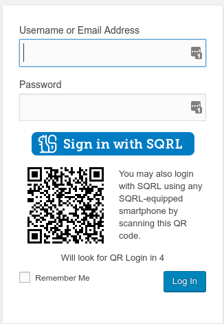
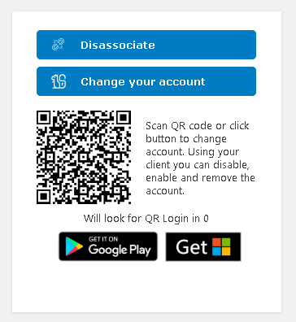
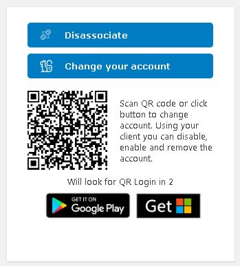

# WordPress SQRL Login Plugin

SQRL can be used to log in to a site in a secure manner without giving away any personal information. This plugin enables that functionallity.

Instead of using a username, email and a password, SQRL uses an app to login to SQRL-aware websites.

When SQRL logs you into a website, your identity is a long code that looks like this: E6Qs2gX7W-Pwi9Y3KAmbkuYjLSWXCtKyBcymWloHAuo.

Your SQRL identity is a different long code for every website you login to, but it is always the same code when you return to a site you visited before. This means that websites never know who you are, but they do know when you return.

You may choose to remain anonymous to a website, such as when you post a response to someone's blog. SQRL never identifies you by anything other than that long code.

In other cases you will want to be known, like when you use SQRL to login as you at Amazon, Facebook, Netflix, or your bank. In those cases, you would inform Amazon that that particular code is actually you. SQRL lets you do that.

Special thanks to:

@davidshimjs (Sangmin, Shim) for writing a great javascript library for QRCode creation. (https://github.com/davidshimjs/qrcodejs)
@jaredatch (Jared Atchison) for writing a plugin for disabling users that I took inspiration from. (https://github.com/jaredatch/Disable-Users)

## Screenshots

Note: The "Will look for QR Login in 3" is a countdown for checking login. Every 5...4...3...2...1 seconds this plugin checks if a QR login has happened. This is because there is no live direct connection between the plugin, the server, and the device the user uses to log in.

The first screenshot shows the login screen. This plugin adds the SQRL login functionality on the login screen only.
Registering happens automatically, but only when the WP site is allowing registrations. This is necessary to ensure the smooth first time visitor experience that SQRL users are expecting.

---

This second screenshot shows the user's profile when logged in with username and password, as it looks before having enabled SQRL for logging in.

---

This third screenshot shows the user's profile after having enabled SQRL for logging in.
